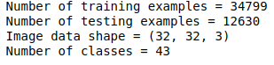
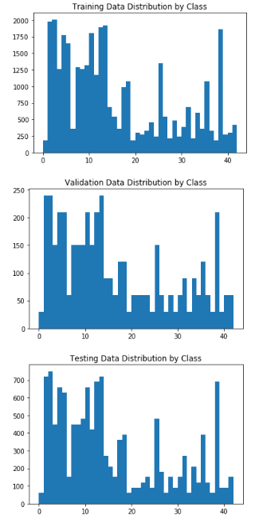
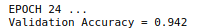
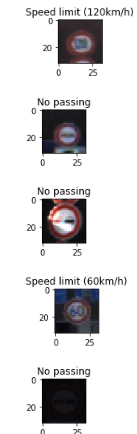
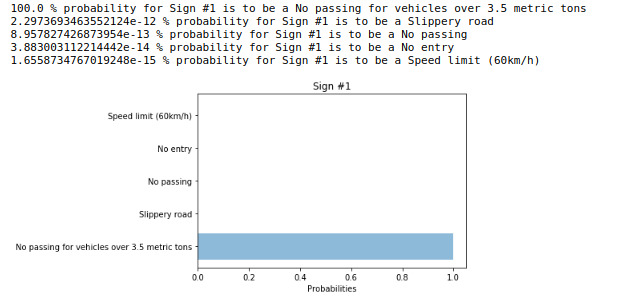

# **Traffic Sign Recognition** 

## Overview

This repository contains an an IPython Notebook with the code for Traffic Sign Recognition system, an html file displaying the results, and a write-up (this README).

---

**Purpose**

The goals / steps of this project are the following:
* Load the data set (see below for links to the project data set)
* Explore, summarize and visualize the data set
* Design, train and test a model architecture
* Use the model to make predictions on new images
* Analyze the softmax probabilities of the new images
* Summarize the results with a written report

## Rubric Points
Here I will consider the [rubric points](https://review.udacity.com/#!/rubrics/481/view) individually and describe how I addressed each point in my implementation:

### Submission Files:
The IPython [IPython Notebook](https://github.com/iansebas/CarND-Traffic-Sign-Classifier-Project/blob/master/Traffic_Sign_Classifier.ipynb), [html file](https://github.com/iansebas/CarND-Traffic-Sign-Classifier-Project/blob/master/Traffic_Sign_Classifier.html), and [writeup](https://github.com/iansebas/CarND-Traffic-Sign-Classifier-Project/blob/master/README.md) are provided.

### Dataset Summary
I calculate the stats of the dataset as follow:

### Exploratory Visualization
I visualize the distributions and realize that all the datasets have similar distribution of classes

### Preprocessing
All images were normalized to ease the numerical optimization. Besides normalization, I made every single class have the same probability of being drawn. This is achieved by oversampling the classes with less samples. Although test set has the same distribution as the unaugmented training set, by oversampling minority classes, I attemp to prevent overfitting to the majority classes. 

### Model Architecture
I used LeNet without any modifications to the original architecture. I chose not use a more "complex" architecture because a simple network (like LeNet) allowed me to iterate faster.

### Model Training

The details of my training scheme are as follow:

epochs : 24
batch size : 64
optimizer : tf.train.AdamOptimizer(learning_rate = 0.001)
initializer :  tf.contrib.layers.xavier_initializer()

### Solution Approach

A batch size of 64 to [avoid sharp minima](https://arxiv.org/pdf/1609.04836.pdf). The epoch was set to 24 after some trial-error. To prevent overfitting, training was concluded by early-stopping when validation accuracy was decreasing noticeably. My validation accuracy was:

The test accuracy was 0.922. 

### Acquiring New Images
Five random images were randomly selected from [The German Traffic Sign Benchmark ](http://benchmark.ini.rub.de/) :

The images were re-sized to 32x32. Interestingly enough, three images of the same class were randomly sampled in this example.

### Performance on New Images
I achived an accuracy of 80%. This result is noticeably lower than the result on test set (92.2%).  However, it is important to notice that the new images dataset is only 5 images, and thus accuracy fluctation cannot be considered wholy representative.

### Model Certainty
In all the 5 images, including the misclassified sample, the network shows high certainty on its "decision". The probabilities are virtually 100% in all cases. This could indicate that the network is overfitting as it failed to attain 100% accuracy.

